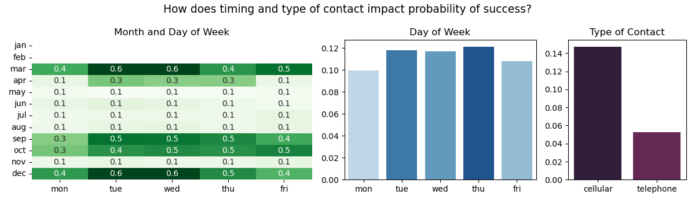
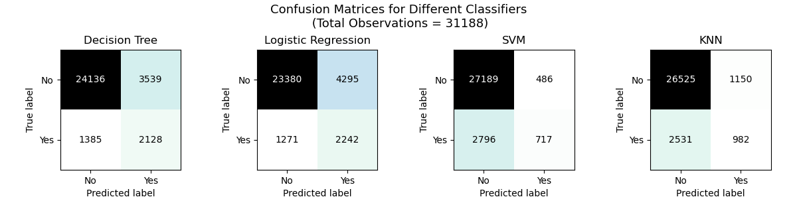

# Practical Application Assignment 17.1: Comparing Classifiers
 In this third practical application assignment, we evaluate different classifiers (k-nearest neighbors, logistic regression, decision trees, and support vector machines) to predict if a customer subscribes to a term deposit as a result of a phone marketing campaign.

 ## Business Understanding

 We have the data from a marketing campaign conducted by a Portugese bank related to bank deposit subscription. Our goal is to build and evaluate a model that predict the probability of success of a contact, i.e. if the client subscribes the deposit. Such a model can be used to target customers that have a higher chance of responding to such a campaign and also help manage the resources more efficiently, such as the human effort involved in making the phone calls, following up with customers, etc.

 ## Data
 We have approximately 41k observations in the full dataset; this includes 21 feature columns and 1 target column which denotes if a customer subscribed to the term deposit or not. Fortunately, there seem to be no missing values in the dataset and the numerical values do not seem to have outliers. Therefore, not a lot of cleaning is needed.

 However the dataset is highly imbalanced between classes. Only **11.2%** of the customers are in class *'yes'*, who end up subscribing to the deposit at the end of the call. We should make note of this imbalance since it will impact our selection of scoring metric, and the classification algorithm later on.

 

**Note**: Although the data does not seem to have any missing values, some of the categorical variables are 'unknown', which we will treat as a separate category. Additionally, there seem to be no observations for the month of Jan and Feb. In a real-world situation, <u>this would cause me to suspect that I do not have access to a complete dataset</u>.

 ### Exploratory Data Analysis

Before building any models, we want to visualize the impact of some of the variables that we intuitively think will impact the probability of campaign success. I have bucketed them into 2 categories: demographic factors, financial factors, and timing of campaign.

#### Demographic factors
Instead of using age as a continuous variable, I created bins for different age groups. We can see that the probability of a successful outcome changes a lot with the age group. The 60+ customers end up subsribing to a deposit nearly 40% of the time, significantly higher than the 11.3% overall chance of success.

Marital status does not seem to have a huge impact. Most of the people in the 18-24 age group would presumably be single, and in the 60+ category, we have higher subscription rates across the board.
 

Lack of a formal education results in a higher probability of subsription to a term deposit.

 #### Impact of timing of campaign
  

 ## Modeling
 Choose F-1 score as the 

 ### Logistic Regression

 ### K-Nearest Neighbors

 ### Decision Trees

 ### Support-Vector Machines

 ## Comparing Classifiers

 

 

 ## Best Classification Algorithm: Decision Trees

**Visualize Tree**

**Feature Importance for Decision Tree Classifier**

**Does feature importance align with exploratory data analysis?**
#### Impact of previous campaign
 

