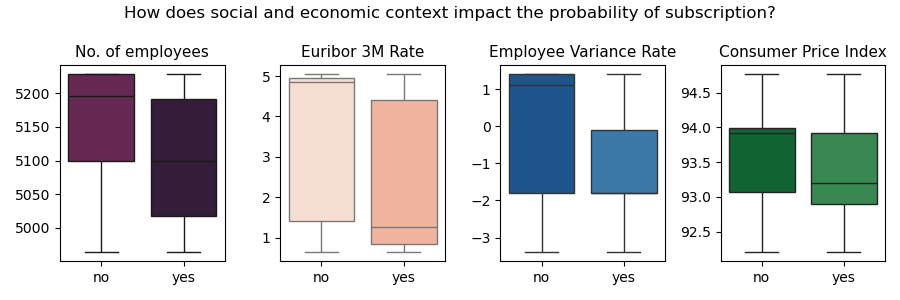
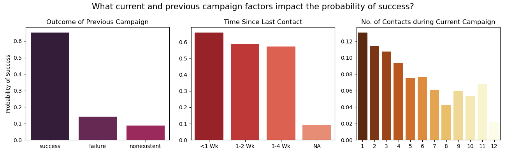
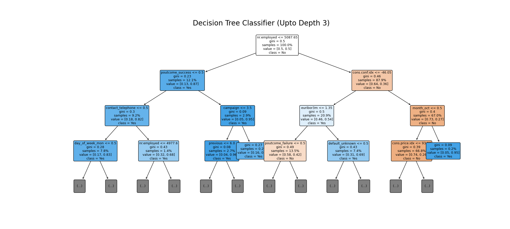

# Practical Application Assignment 17.1: Comparing Classifiers
 In this third practical application assignment, we evaluate different classifiers (k-nearest neighbors, logistic regression, decision trees, and support vector machines) to predict if a customer subscribes to a term deposit as a result of a phone marketing campaign.

 ## Data

 ### Preparation and Cleaning

 ### Exploratory Data Analysis

 #### Impact of customer finances
  

#### Impact of demographic factors
 

#### Impact of previous campaign
 

 ## Modeling
 Choose F-1 score as the 

 ### Logistic Regression

 ### K-Nearest Neighbors

 ### Decision Trees

 ### Support-Vector Machines

 ## Comparing Classifiers

 

 

 ## Best Classification Algorithm: Decision Trees

**Visualize Tree**

**Feature Importance for Decision Tree Classifier**

**Does feature importance align with exploratory data analysis?**

