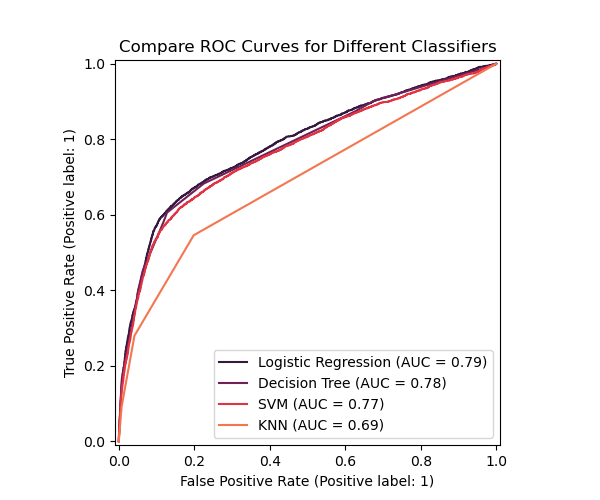
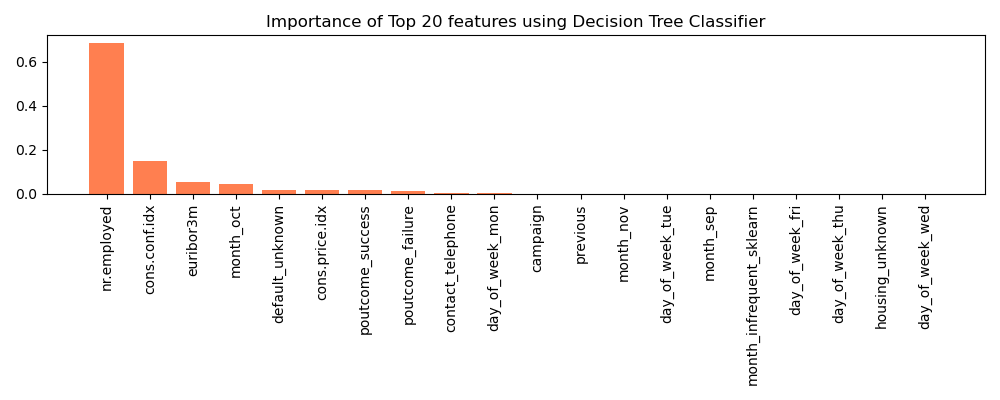

# Practical Application Assignment 17.1: Comparing Classifiers
 In this third practical application assignment, we evaluate different classifiers (k-nearest neighbors, logistic regression, decision trees, and support vector machines) to predict if a customer subscribes to a term deposit as a result of a phone marketing campaign.

 ## Business Understanding

 We have the data from a marketing campaign conducted by a Portugese bank related to bank deposit subscription. Our goal is to build and evaluate a model that predict the probability of success of a contact, i.e. if the client subscribes the deposit. Such a model can be used to target customers that have a higher chance of responding to such a campaign and also help manage the resources more efficiently, such as the human effort involved in making the phone calls, following up with customers, etc.

 ## Data
 We have approximately 41k observations in the full dataset; this includes 21 feature columns and 1 target column which denotes if a customer subscribed to the term deposit or not. Fortunately, there seem to be no missing values in the dataset and the numerical values do not seem to have outliers. Therefore, not a lot of cleaning is needed.

 However the dataset is highly imbalanced between classes. Only **11.2%** of the customers are in class *'yes'*, who end up subscribing to the deposit at the end of the call. We should make note of this imbalance since it will impact our selection of scoring metric, and the classification algorithm later on.

 

**Note**: Although the data does not seem to have any missing values, some of the categorical variables are 'unknown', which we will treat as a separate category. Additionally, there seem to be no observations for the month of Jan and Feb. In a real-world situation, <u>this would cause me to suspect that I do not have access to a complete dataset</u>.

 ### Exploratory Data Analysis

Before building any models, we want to visualize the impact of some of the variables that we intuitively think will impact the probability of campaign success. I have bucketed them into 2 categories: demographic factors, financial factors, and timing of campaign.

**1. Demographic factors**

Instead of using age as a continuous variable, I created bins for different age groups. We can see that the probability of a successful outcome changes a lot with the age group. The 60+ customers end up subsribing to a deposit nearly 40% of the time, significantly higher than the 11.3% overall chance of success.

Marital status does not seem to have a huge impact. Most of the people in the 18-24 age group would presumably be single, and in the 60+ category, we have higher subscription rates across the board.
 

Lack of a formal education results in a higher probability of subsription to a term deposit.

**2. Timing and Mode of contact**

 Timing of the campaign seems to have a huge impact on the probability of success. In the leftmost heatmap, we can see that probability of subscriptions are lower during summer months. They are also in later part of the year, with November being an outlier with low subscription success. 
  

The day of the week does not appear to have a huge impact. But contacting people on their cellphone v/s the telephone increases the chances of subscription. 

**3. Financial factors**: I also looked at financial factors such as previous default and the existence of a housing/personal loan. Surprisingly, they did not seem to impact the subscription rates.

 ## Modeling

Having explored the data, and relationships between variables, we are ready to start building our models. We are going to build and evaluate 4 models: Logistic Regression. K-nearest neighbors, Decision Trees and Support Vector Machines. In the section below, we identify the advantages and disadvantages of each. ALl models include hyperparameter tuning using a GridSearch and 5-fold cross validation.

**Evaluation Metric:** In a business case like this, I would have used *precision* as the scoring metric, since we want to identify customers that do subsribe to deposits, i.e. minimize false positives. However, <u>since our data is very imbalanced I chose *F1-score* as the evaluation metric</u>.

We exclude the *duration* as a predictive variable, because this is not known before the call and does not help us in building an efficient marketing strategy.

### Comparing Classifiers

1. **Logistic Regression**

    Advantages: Deals well with class imbalance, Easy to train, High interpretability.
    
    Disadvantages: Inhenrently Linear (need to transform variables into polynomials), makes assumptions about underlying distributions. 

2. **K-Nearest Neighbors**

    Advantages: Simple, quick to train, non-parametric
    
    Disadvantages: Slow to predict, not good with class imbalance

 3. **Decision Trees**

    Advantages: Deals well with class imbalance, Easy to train, High interpretability, Can capture non-linear relationships.
    
    Disadvantages: Prone to over-fitting, Need lots of data to train

 4. **Support Vctor Machines**

    Advantages: Deals well with class imbalance, can capture non-linear relationships, robust to over-fitting in high dimensions.
    
    Disadvantages: Slow to train, lacks interpretability, cannot handle very large amounts of data.

  

In the plot below, we look at the ROC curves using test data for all 4 classifiers. KNN underperforms, but the other three algorithms appear to have very similar AUC scores, with Logistic Regression being the highest. 
 

However, looking at the confusion matrices paints a different picture. KNN and SVM have a higher recall than precision, and Logistic Regression seems to mis-classify a lot more 'no' as a 'yes'. The well-understood avantages of decision trees, combined with these metrics, leads us to believe that for our business case, decision tree is the best classification algorithm.

 

 ## Best Classification Algorithm: Decision Trees
We want to see which features are the most important for classification, and do these align with our intuitive understanding of the data from earlier. 

**Feature Importance for Decision Tree Classifier**

In the chart below, we can see that socio-economic variables like No. of Employees, Consumer Confidence Index, and Euribor 3M rate are some of the most important features. 

This has two distinct disadvantages:
* We observe data over a small period of time May'08 - Nov '10, not enough to capture even a full economic cycle.
* This does not help us build an understanding of a more efficient marketing campaign, since these variables are outside of the realm of control.

**Does feature importance align with exploratory data analysis?**

However, we can also see that that *poutcome* and *previous* (no. of contact performed in this campaign) also seem to have ahigh feature importance. 

If we look the charts below, we can see that a customer that previously subscribed to a term deposit has >60% chance of subscription. Additionally, it is best to contact such customers within a week or two after previous contact.
 

For the current campaign, the chances of a customer subscribing to a deposit decreases as no. of calls increase. This aligns with our understanding of human behavior.

## Decision Tree Excluding Soci-Economic Features

In order to build a better understanding of a customer that will subscribe to the deposit, and to time our campaign efficiently, we build a decision tree without the socio-economic features that a campaign has no influence over. 

Removing these variables leads to a clear decrease in classification scoring, as measured by AUC score. But the impact is not as significant as we expected. We can still use this new tree model to gain valuabke insights.

**Visualize Tree**

If we look at a visualization of this updated tree model, we can easily see that age, time of campaign, and method of contact seem to be some of the most important features. Additonally, financial aspects such as previous default and existence of housing/personal loan also seem to impact the probability of a successful outcome.

The results of this new model align with our intuitive understanding of the data, and help us design actionable items outlined below.

## Actionable Insights

1. Target customers based on age group, especially 18-24 year olds and 60+/retired customers.
2. Conduct campaigns via a cell phone as opposed to telephone. (This insight may be redundant in 2024.)
3. Campaings during Sep, Oct and Dec have a high chance of success. Summer months, and November (leading into the holiday season) do not see high rates of subscription.
4. Contact customers that have subscriped to deposits of a previous marketing campaign.
5. Terminate attempts to market to a customer after 5 calls in a marketing campaign. Follow-up with customers within a week or two of previous call.
6. Prioritze customers with no default and no housing/personal loan.

In the image above, we have an example of a 43 year old single technician, with no loans and defaults, who was contacted for the first time in Nov using telephone. The predicted probability of subscribing to a term deposit is 91.6%. Keeping everything else constant, if we change the momth of campaign or the method of contact, we can see the probability change.

## Next Steps
From a modeling perspective, for the next steps, we can try a few things to improve the classification accuracy. Some examples include:

* Employ stochastic gradient descent to train both SVM and trees. This would significantly speed-up the former.
* Using ensemble methods such as boosting and bagging to build decision tree classifiers that over-fit less.
* Handle class imbalances using sampling methods such as SMOTE, ADASYN, and so on.

However, the best next business step would be employ some of the actionable insights and conduct A/B tests to see if they improve the results of the marketing campaign.

